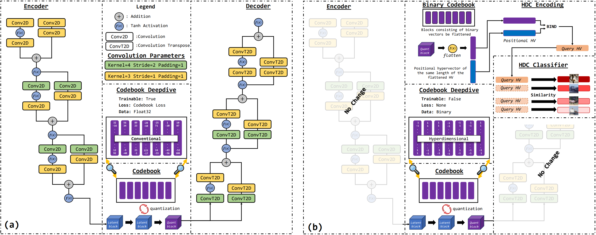
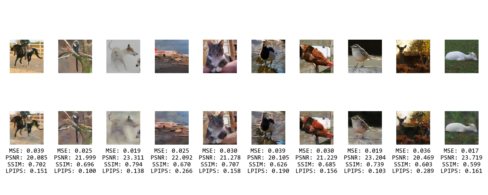

# HDVQ-VAE: Binary Codebook for Hyperdimensional Latent Representations

This repository contains the source code for the paper "HDVQ-VAE: Binary Codebook for Hyperdimensional Latent Representations," which introduces a novel integration of Hyperdimensional Computing (HDC) with the Vector Quantized Variational Auto Encoder (VQ-VAE) architecture.



## Table of Contents
- [Installation](#installation)
- [Replicating Results](#replicating-results)
- [Citation](#citation)

## Installation

Follow these instructions to set up the project environment:

### Step 1: Clone the Repository

Clone the repository to your local machine:

```bash
git clone https://github.com/AustinJamesBryant/HDVQ-VAE
cd HDVQ-VAE
```

### Note on Code Updates

Please be aware that while this repository hosts the original code described in the paper, there has been an update since its initial release. A single-line fix has been applied to address a specific issue. This fix is available on a separate branch within this repository. To access and use the updated code, please switch to the appropriate branch using the following Git command:

```bash
git checkout paper-fixed
```


### Step 2: Set Up the Virtual Environment

Create and activate a virtual environment:

#### For Windows:

```bash
python -m venv venv
.\venv\Scripts\activate
```

#### For macOS and Linux:

```bash
python3 -m venv venv
source venv/bin/activate
```

### Step 3: Install Requirements

Install the required packages from the `requirements.txt` file:

```bash
pip install -r requirements.txt
```

## Replicating Results

To replicate the results described in the paper, follow these detailed steps:

### Step 1: Train VQ-VAE and CNN Classifier

1. **Navigate to the Traditional Experiment Directory:**

   ```bash
   cd experiment/traditional
   ```

2. **Run the VQ-VAE Training Script:**

   ```bash
   python train_vq_vae.py
   ```

3. **After the VQ-VAE has finished training, run the CNN Classifier Training Script:**

   ```bash
   python train_cnn_classifier.py
   ```

### Step 2: Train HDVQ-VAE and Classifiers

1. **Navigate to the Hyperdimensional Experiment Directory:**

   ```bash
   cd ../hyperdimensional
   ```

2. **Run the HDVQ-VAE Training Script:**

   ```bash
   python train_hdvq_vae.py
   ```

3. **After the HDVQ-VAE has finished training, run the Classifier Training Scripts:**

   - **CNN Classifier:**

     ```bash
     python train_cnn_classifier.py
     ```

   - **HDC Classifier:**

     ```bash
     python train_hdc_classifier.py
     ```

### Step 3: Generate Comparison Graphs

1. **Run HDC Classifier graph Generation Script:**

   ```bash
   python graph_hdc_classifier.py
   ```

1. **Navigate back to the Experiment Directory:**

   ```bash
   cd ../
   ```

2. **Run the Graph Generation Script:**

   ```bash
   python graph_cnn_comparison.py
   ```

### Step 4: View Results

- **The reconstruction results can be found in the following directory:**

  ```plaintext
  experiment/hyperdimensional/results/stl10
  ```

- **The graphed CNN classifier results can be found in the following directory:**

  ```plaintext
  experiment
  ```

- **The graphed HDC classifier results can be found in the following directory:**

  ```plaintext
  experiment/hyperdimensional/results/hdc_stl_classifier
  ```

### Visual Results

- **Reconstruction Results:**

  

- **Graphed CNN Classifier Comparison With Heatmaps:**

  

- **Graphed HDC Classifier:**

  

## Citation

If you use this work in your research, please cite it as follows:

```bibtex
@article{hdvqvae2024,
  title={HDVQ-VAE: Binary Codebook for Hyperdimensional Latent Representations},
  author={Austin Bryant, Sercan Aygun},
  journal={Journal Name},
  year={2024},
  url={Paper URL}
}
```
